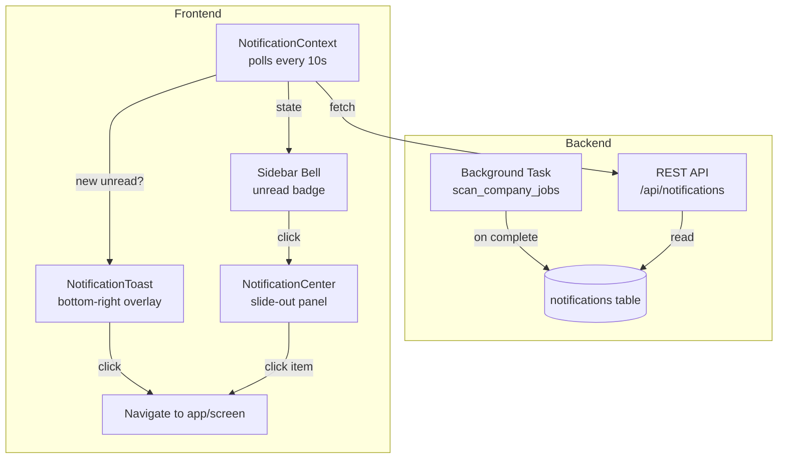

# Notification / Alert System

## Summary

A full-stack notification system that alerts users when background tasks complete, regardless of which screen they're viewing. Includes auto-dismissing toast popups, a persistent notification center with unread badges, and configurable display duration.

## Architecture



## Files Changed

### New Files

| File | Description |
|------|-------------|
| [NotificationContext.jsx](file:///home/rdannenbring/Development/JobApplicationAutomator/frontend/src/context/NotificationContext.jsx) | Global React context: polling, toast queue, read state, settings |
| [NotificationToast.jsx](file:///home/rdannenbring/Development/JobApplicationAutomator/frontend/src/components/NotificationToast.jsx) | Floating toast overlay (bottom-right), auto-dismiss, click-to-navigate |
| [NotificationCenter.jsx](file:///home/rdannenbring/Development/JobApplicationAutomator/frontend/src/components/NotificationCenter.jsx) | Slide-out notification panel with unread/all filter, mark-all-read |

### Modified Files

| File | Change |
|------|--------|
| [database_service.py](file:///home/rdannenbring/Development/JobApplicationAutomator/backend/services/database_service.py) | Added `Notification` model, migration SQL, and CRUD methods |
| [main.py](file:///home/rdannenbring/Development/JobApplicationAutomator/backend/main.py) | Added 3 API endpoints + notification emission in `scan_company_jobs` |
| [main.jsx](file:///home/rdannenbring/Development/JobApplicationAutomator/frontend/src/main.jsx) | Wrapped app with `NotificationProvider` |
| [App.jsx](file:///home/rdannenbring/Development/JobApplicationAutomator/frontend/src/App.jsx) | Added toast/center overlays + navigation handler for click-through |
| [Sidebar.jsx](file:///home/rdannenbring/Development/JobApplicationAutomator/frontend/src/components/Layout/Sidebar.jsx) | Added bell icon with animated unread badge |
| [Settings.jsx](file:///home/rdannenbring/Development/JobApplicationAutomator/frontend/src/pages/Settings.jsx) | Added "Notification Display Duration" slider (3-30s) |
| [index.css](file:///home/rdannenbring/Development/JobApplicationAutomator/frontend/src/index.css) | Added `slideUp`, `slideRight`, `pulse` keyframe animations |

## API Endpoints

| Method | Path | Description |
|--------|------|-------------|
| `GET` | `/api/notifications` | List up to 50 recent notifications for the current user |
| `PUT` | `/api/notifications/{id}/read` | Mark a single notification as read |
| `PUT` | `/api/notifications/read-all` | Mark all notifications as read |

## Notification Data Model

```json
{
  "id": 1,
  "user_id": 1,
  "category": "success",
  "title": "Direct listing found at Google",
  "message": "We found your job listing on Google's careers page...",
  "link_screen": "lifecycle",
  "link_app_id": 42,
  "is_read": false,
  "created_at": "2026-05-20T04:40:00"
}
```

| Field | Purpose |
|-------|---------|
| `category` | `success` / `info` / `warning` / `error` — controls icon & color |
| `link_screen` | App screen to navigate to (e.g. `lifecycle`, `detail`) |
| `link_app_id` | Application ID to load before navigating |

## UI Features

### Toast Notifications
- Appear bottom-right on any screen
- Auto-dismiss after configurable duration (default 8s)
- Stacked with decreasing opacity (max 4 visible)
- Click to navigate to the relevant screen/application
- Manual close button
- Slide-up animation with glassmorphism styling

### Notification Center (Sidebar)
- Slide-out panel from the left (over the sidebar)
- **Unread / All** toggle filter
- **Mark All Read** button
- Click any item to navigate and mark as read
- Relative time formatting ("Just now", "5m ago", "2h ago")
- Unread indicator dot per notification

### Sidebar Bell Icon
- Animated pulse badge with unread count
- Shows count as `9+` when exceeding 9
- Active state when notification center is open

### Settings
- Slider in Appearance tab: "Notification Display Duration"
- Range 3s to 30s, persisted via `ui_config.notification_duration`

## How Background Tasks Emit Notifications

When `scan_company_jobs` completes, it creates a notification:

```python
database_service.create_notification(
    user_id=user_id,
    title="Direct listing found at Google",
    message="We found your job listing on Google's careers page...",
    category="success",
    link_screen="lifecycle",
    link_app_id=app_id,
)
```

> [!TIP]
> To add notifications to other background tasks, simply call `database_service.create_notification()` with the appropriate parameters. The frontend will pick them up automatically via polling.
